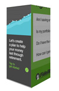
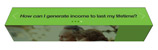
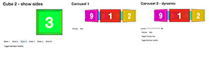
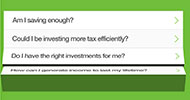
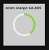

# HTML5 Functionality Templates 说明

------

1. 主要关于banner的一些常用模块，比如scrollbar，3D旋转，share，map，slider等. 
2. 还有banner中常用的效果，比如下雪，水波纹，序列图，上升的泡泡等
3. 知识点主要是`3d属性，canvas绘图，google地图，slider，scoller`

> * 请每次分享新的code，都稍稍整理一下使用说明
> * 如果你准备分享的功能已经有了，你可以创建子文件夹
> * 使用markdown

下面我们来看一下有哪些常用功能。
### [3DCUBE](3DCube)
主要记得两个属性的设置 *perspective: 800px; transform-style: preserve-3d*;

* Demo 最基础的六面体，可以设置背面是否可见
* Box_Demo

* Carousel_3D
* Carousel_3D_Advance
* Cube_show_sides

### [3DFlip](3DFlip)
和上面一样，需要设置开启3d属性

* 3DFlip 是一个菜单翻转的动画

* CardFlip，cardFlip2 都是正反两面的页面翻转。 如果同时加上y轴或者x轴方向的位移，可以实现更多的效果
* cardFlip_calendar  这是一个日历的翻转效果，依然是设置正反面，通过旋转拼成日历

### [360C](360C)
360度旋转，用了两种方法。

1. 拼成一张图，改变background－position
2. 分成36张图，10度一张，然后切换那一张图显示，虽然本例里用了display：none／block，但是我认为最好不要用display来控制，会有效率问题

### [banner template](banner template)
这里有各个平台的std banner模板。

### [bubbles](bubbles)
泡泡上升的效果，结合水波向上移动。
这里因为泡泡比较少，用的tween 移动dom的方式。

***如果有大量的泡泡移动，建议转为canvas。*** 

    function makeBubbles(num, life, delay) {
    	var bubbleflakes = num == 0 ? 120 : num;
    	if (life == 0) life = 1.2;
    	if (delay == 0) delay = 0;
    	var timer;
    	var perDelay;
    	var ease;
    	for (var i = 0; i < bubbleflakes; i++) 		{
    		bubbleHolder.getNextHighestDepth());
        	var icon = $("
");
        	var width = Math.random() * 40 + 60;
        	icon.css({
            	"position": "absolute",
            	"top": 200 + width,
            	"left": Math.random() * 300 - width/2,
            	"width": width
        	});
        	icon.addClass('icon');
        	path = 'bubble.png';
        	icon.append("");
        	icon.appendTo(bubbles);
        	if (Math.random() > .8) {
            	timer = Math.random() * 1.5 + 1.6;
            	ease = Quint.easeIn;
        	} else {
            	timer = Math.random() * 1.7 + 0.8;
            	ease = Linear.easeIn;
        	}
        	perDelay = Math.random() * life + delay;
        	TweenLite.to(icon, timer, {
            	delay: perDelay,
            	y: -(300 + width - 10),
            	x: Math.random() * 150 - 60,
            	ease: ease
        	});
    	}
	}


### [canvas擦除效果](canvas擦除效果)
1.通过修改globalCompositeOperation来达到擦除的效果

	ctx.globalCompositeOperation = "destination-out";
	
2.使用clip来达到擦除效果
	
	ctx.clip()


### [circleProgress](circleProgress)
用canvas的arc函数，画出需要的角度。



### [color_change_canvas](color_change_canvas)
 这个效果是SALA加toyota的汽车换颜色。
 
 **依然利用canvas的~~globalCompositeOperation~~属性**
 
 320x150和700，Car_Color_Change，改变颜色的时候，是将新的颜色画到画布上，改变宽度
 
	if (width <= self._canvas.width) {  
 		ctx.drawImage(self.nextColorImage, 0, 0, width, canvas.height, 0, 0, width, canvas.height);
 		width += widthStep;
 	}
 customChange 的例子是晋级版本。 换新的颜色的以后加上了动画。
 
 1. 先将动画导出成序列图
 2. 刷帧取到当前需要的动画图结合要换的颜色图 `globalCompositeOperation = "destination-in"`,生成当前动画颜色图
 3. 将2生成的图叠加到主canvas上，形成最终颜色图
 
### [hero3D](hero3D)
这个例子是鼠标互动改变位移和视角，简单的图层叠加，效果不错。

### [leaves](leaves)
和之前的泡泡的例子相似，创建dom，改变top，left

### [lineProgress](lineProgress)
和circleProgress类似。

### [map](map)
google地图的一个例子。 功能有zip查询，Geo查询，并且返回最近的点

### [playKeyFrame](playKeyFrame)
播放序列图，上面的360度旋转中应用到。 拼成一张图，改变background－position。

### [scroll](scroll)
网上下载的两个类库。很好用。

### [shareFunction](shareFunction)
几种常见的share。其中download在手机端用到了一个库 canvas-toBlob




### [slider](slider)
有demo1_stepX，demo2_step0，第一种是，从1到3，中间看见2. 第二种是，从1到3，中间没有2直接跳转.

### [snow](snow)
canvas下雪效果

### [wave](wave)
水波纹。

	var wave1 = $('#lake-img').lake({
            'waves': 6,
            'scale': 0.5
        });
    wave1.start();

